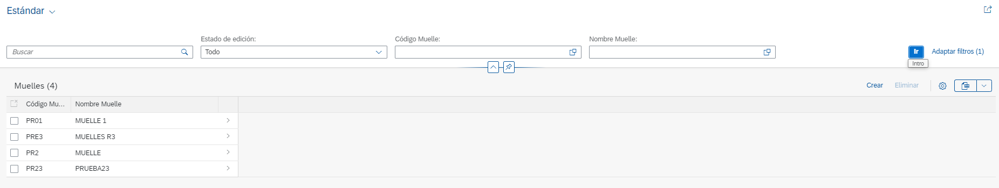
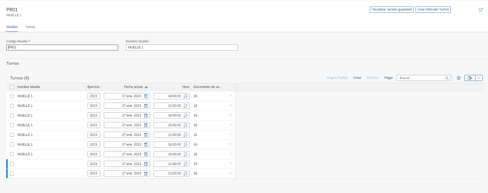
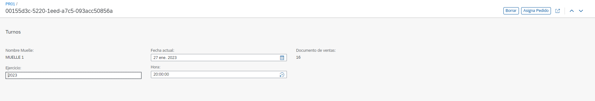

# RAP002 - Turnos Carga Muelles

## Overview

Aplicación transaccional basada en Fiori Elements y ABAP RESTful Application Programming Model.

 - List Report Muelles

 - Object Page Muelles

 - Object Page Turnos

## Guía de objetos
- Backend
  - [Diccionario de datos](sources/diccionario_datos.md)
  - [Core Data Services (CDS)](sources/core_data_services.md)
  - [Behavior definitions](sources/behavior_definitions.md)
  - [Service definitions](sources/service_definitions.md)
  - [Service bindings](sources/service_bindings.md)
  - [Definición de clases](sources/definicion_clases.md)
- Frontend
