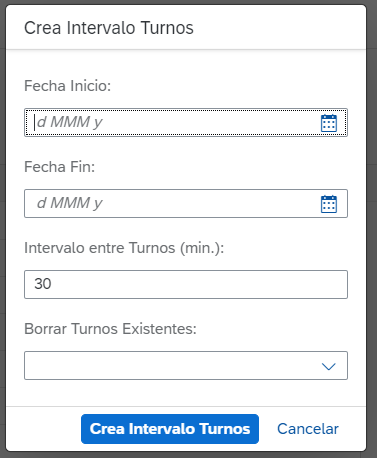
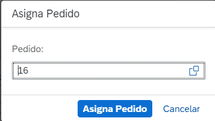
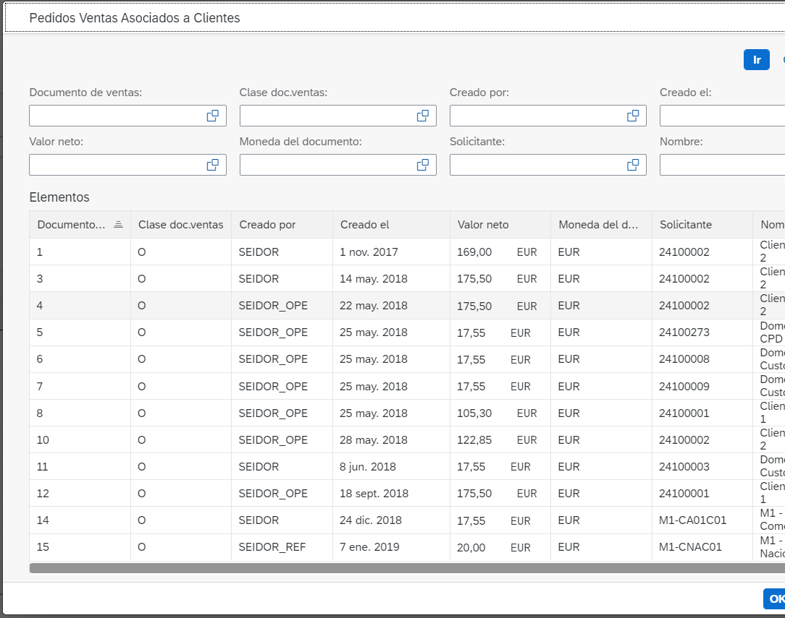

# Behavior definitions
- [Behavior definitions](#behavior-definitions)
  - [ZSRAP_C_MUELLES](#ZSRAP_C_MUELLES)
    - [Acciones](#acciones)
      - [popupFecha](#popupFecha)
      - [popupPedido](#popupPedido)
    - [Determinaciones](#determinaciones)
      - [setIdMuelle](#setIdMuelle)
    - [Validaciones](#validaciones)
      - [validaMuelle](#validaMuelle) 
      - [validaFecha](#validaFecha)
  - [ZSRAP_C_MUELLES](#ZSRAP_C_MUELLES) Proyección
  
## [ZSRAP_C_MUELLES](#ZSRAP_C_MUELLES)
Behavior managed implementado en la clase [ZBP_SRAP_I_MUELLES](definicion_clases.md/#ZBP_SRAP_I_MUELLES). Al utilizar borradores hemos de añadir la acción ***with draft*** a las asociación tanto del padre como del hijo.

<pre>
association _Turnos { create; with draft; }
association _Muelles { with draft; }
</pre>

Contenido completo del behavior
<pre>
managed implementation in class zbp_srap_i_muelles unique;
//strict;
with draft;

define behavior for ZSRAP_I_MUELLES //alias <alias_name>
persistent table zrap_pv_muelles
draft table zrap_d_muelles
lock master total etag Codigo
authorization master ( instance )
//etag master <field_name>
{
  create;
  update;
  delete;
  field ( numbering : managed ) Muelleid;
  field ( mandatory ) Codigo;

  action ( features : instance ) popupFecha parameter ZSRAP_CREA_TURNOS result [1] $self; //Para actualiar

  determination setIdMuelle on modify { create; } //Cuando se modifica la entidad
  validation validaMuelle on save { field Codigo; create; }

  association _Turnos { create; with draft; }

  mapping for zrap_pv_muelles
  {
    Muelleid = muelleid;
    Codigo = codigo;
    Nombre = nombre;

  }
}

define behavior for ZSRAP_I_TURNOS //alias <alias_name>
persistent table zrap_pv_turnos
draft table zrap_d_turnos
lock dependent by _Muelles
authorization dependent by _Muelles
//etag master <field_name>
{
  update;
  delete;
  field ( readonly ) Muelle, Nombre, Vbeln;
  field ( numbering : managed ) Turnoid;

  action ( features : instance ) popupPedido parameter ZSRAP_ASIGNA_PEDIDO result [1] $self;

  validation validaFecha on save { field Anyo, Dia, Hora; create; }
  association _Muelles { with draft; }

  mapping for zrap_pv_turnos
  {
    Anyo = anyo;
    Dia = dia;
    Hora = hora;
    Muelle = muelle;
    Turnoid = turnoid;
    Vbeln = vbeln;
  }

}
</pre>

### [Acciones](#acciones)
Las acciones `update` y `delete` dependen de la instancia seleccionada.  
#### [popupFecha](#behavior-definitions)
Esta acción nos permite crear turnos de forma automática a partir de unos parametros de entrada selecconados y eliminar los que ya existen. Tiene un parametro de entrada que es la CDS abstracta [ZSRAP_CREA_TURNOS](core_data_services.md/#zsrap_crea_turnos). 

#### [popupPedido](#behavior-definitions)
Esta acción nos permite asignar un pedido de venta al turno seleccionado. Se utiliza un parametro de entrada el cual nos muestra un popup en el cual podemos seleccionar el pedido usando una ayuda de búsqueda. Para ello utilizamos la CDS abstracta [ZSRAP_ASIGNA_PEDIDO](core_data_services.md/#zsrap_asigna_pedido). 

### [Determinaciones](#determinaciones)
#### [setIdMuelle](#behavior-definitions)
Determinamos un valor paracuando se crea la entidad así por defecto rellenamos los campos Código y Nombre del Muelle
<pre>
 determination setIdMuelle on modify { create; } //Cuando se modifica la entidad
</pre>

### [Validaciones](#validaciones)
#### [validaMuelle](#validaMuelle)
Esta validación se realiza sobre el campo Codigo de la entidad y evita que se dupliquen los códigos de los muelles.

#### [validaFecha](#validaFecha)
Esta validación comprueba que los campos Anyo, Dia, Hora al crear una instancia nueva no se cree anterior a la fecha actual.

## [ZSRAP_C_RAPPORTS](#zsrap_c_rapports)
Proyección del behavior [ZSRAP_I_MUELLES](#ZSRAP_I_MUELLES)
<pre>
projection;
use draft;
//strict;

define behavior for ZSRAP_C_MUELLES //alias <alias_name>
{
  use create;
  use update;
  use delete;

  use action popupFecha as fecha;
  use action borrar as borrarTurno;

  use association _Turnos { create; }
}

define behavior for ZSRAP_C_TURNOS //alias <alias_name>
{
  use update;
  use delete;

  use action popupPedido as pedido;
  use action popupCrea;

  use association _Muelles;
}
</pre>