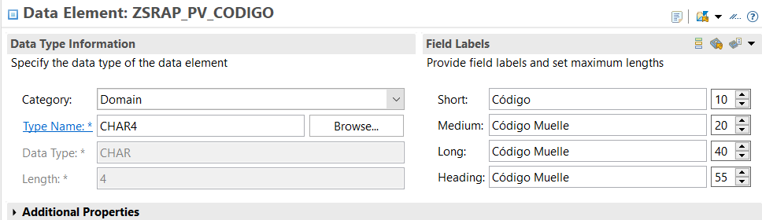
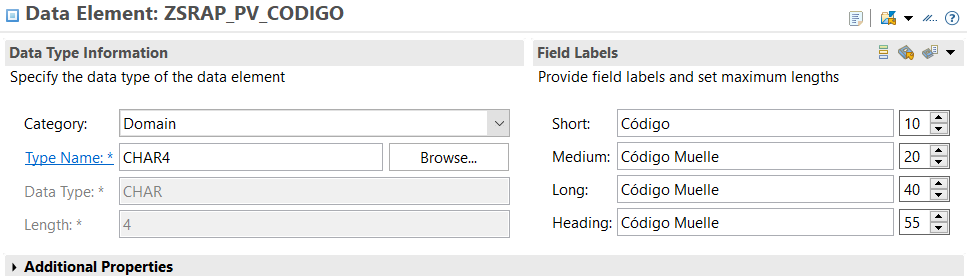

# Diccionario de datos

## Definición de tablas
Para este desarrollo necesitaremos una tabla para Muelles y otra para turnos.  
La tabla para muelles será [ZRAP_PV_MUELLES](#ZRAP_PV_MUELLES) y su homóloga para el borrador [ZRAP_D_MUELLES](#ZRAP_D_MUELLES).  
Un muelle puede tener varios turnos para la carga, en este caso como tenemos habilitado el draft necesitamos dos tablas [ZRAP_PV_TURNOS](#ZRAP_PV_TURNOS) será en la que se almacenan los datos y [ZRAP_D_TURNOS](#ZRAP_D_TURNOS) se utiliza para el draft.

### [ZRAP_PV_MUELLES](#ZRAP_PV_MUELLES) 
Tabla que representa el Business Object (BO) root de la aplicación y almacena los datos relacuinado con los muelles.

<pre>
@EndUserText.label : 'Draft Tabla Muelles'
@AbapCatalog.enhancement.category : #NOT_EXTENSIBLE
@AbapCatalog.tableCategory : #TRANSPARENT
@AbapCatalog.deliveryClass : #A
@AbapCatalog.dataMaintenance : #RESTRICTED
define table zrap_d_muelles {
  key client   : abap.clnt not null;
  key muelleid : sysuuid_x16 not null;
  codigo       : zsrap_pv_codigo;
  nombre       : zsrap_pv_nombre;

}
</pre>

### [ZRAP_D_MUELLES](#ZRAP_D_MUELLES)
<pre>
@EndUserText.label : 'Draft Tabla Muelles'
@AbapCatalog.enhancement.category : #NOT_EXTENSIBLE
@AbapCatalog.tableCategory : #TRANSPARENT
@AbapCatalog.deliveryClass : #A
@AbapCatalog.dataMaintenance : #RESTRICTED
define table zrap_d_muelles {
  key client   : abap.clnt not null;
  key muelleid : sysuuid_x16 not null;
  codigo       : zsrap_pv_codigo;
  nombre       : zsrap_pv_nombre;
  "%admin"     : include sych_bdl_draft_admin_inc;

}
</pre>
Esta sentencia es necesaria para activar el draft
<pre>
"%admin"    : include sych_bdl_draft_admin_inc;
</pre>

### [ZRAP_PV_TURNOS](#ZRAP_PV_TURNOS)
Tabla que representa la asociación de los turnos con los muelles.
<pre>
@E@EndUserText.label : 'Draft Tabla Turnos'
@AbapCatalog.enhancement.category : #NOT_EXTENSIBLE
@AbapCatalog.tableCategory : #TRANSPARENT
@AbapCatalog.deliveryClass : #A
@AbapCatalog.dataMaintenance : #RESTRICTED
define table zrap_d_turnos {
  key client  : abap.clnt not null;
  key turnoid : sysuuid_x16 not null;
  muelle      : sysuuid_x16;
  nombre      : zsrap_pv_nombre;
  anyo        : gjahr;
  dia         : sydatum;
  hora        : syuzeit;
  vbeln       : vbeln_va;
  "%admin"    : include sych_bdl_draft_admin_inc;

}
</pre>

### [ZRAP_D_TURNOS](#ZRAP_D_TURNOS)
<pre>
@E@EndUserText.label : 'Draft Tabla Turnos'
@AbapCatalog.enhancement.category : #NOT_EXTENSIBLE
@AbapCatalog.tableCategory : #TRANSPARENT
@AbapCatalog.deliveryClass : #A
@AbapCatalog.dataMaintenance : #RESTRICTED
define table zrap_d_turnos {
  key client  : abap.clnt not null;
  key turnoid : sysuuid_x16 not null;
  muelle      : sysuuid_x16;
  nombre      : zsrap_pv_nombre;
  anyo        : gjahr;
  dia         : sydatum;
  hora        : syuzeit;
  vbeln       : vbeln_va;
  "%admin"    : include sych_bdl_draft_admin_inc;

}
</pre>
Esta sentencia es necesaria para activar el draft
<pre>
"%admin"    : include sych_bdl_draft_admin_inc;
</pre>

## Definición de elementos de datos

### [ZSRAP_PV_CODIGO](#ZSRAP_PV_CODIGO)

### [ZSRAP_PV_NOMBRE](#ZSRAP_PV_NOMBRE)

## Definición de dominios
